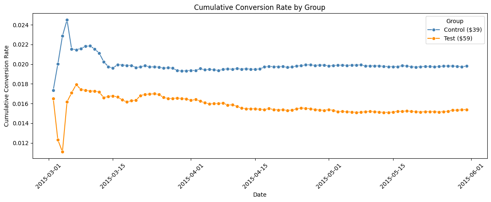

  
  
# Pricing A/B Test Analysis

Analysis of a pricing experiment run by Company XYZ to determine whether 
raising software price from $39 to $59 would increase revenue. 66% of 
users saw the original price, 33% saw the higher price, across 275,000+ 
users over 90 days.

## TL;DR

**Recommend the $59 price point.** It generates **18% more revenue per user** 
($0.91 vs $0.77), and the difference is statistically significant 
(p < 0.001, 95% CI: +$0.09 to +$0.19). The lift holds across major user 
segments and remains stable across the full 90-day test.

The test could have reached the same conclusion in **~3 weeks** instead 
of 90 days, representing significant opportunity cost.

## Key Findings

### 1. $59 Wins on Revenue, Despite Lower Conversion
| Metric | $39 (Control) | $59 (Test) | Lift |
|---|---|---|---|
| Conversion Rate | 1.98% | 1.54% | -22% |
| Revenue Per User | $0.77 | $0.91 | **+18%** |

Conversion dropped as expected with a higher price, but the extra $20 
per sale more than compensated for lost buyers.

### 2. Segment-Level Insights
- **Friend referrals** are the highest-value channel ($1.61 → $1.88 RPU) — 
  these users are pre-sold and not price-sensitive
- **Google ads and SEO** show clear $59 lift
- **Linux users in the $59 group had zero conversions out of 1,701** — 
  flagged as a likely technical bug in checkout, not a real pricing signal
- Smaller segments (seo-bing, seo-yahoo) had insufficient sample to draw 
  conclusions

### 3. Test Ran Too Long
Cumulative conversion rates stabilized by **day ~17-20**, but the test 
ran for 90 days. The additional 70 days added precision but did not 
change the conclusion — that traffic could have powered additional 
experiments.

## Methodology
- **Data validation:** Sample Ratio Mismatch check (actual 64/36 vs 
  planned 66/33 — minor deviation, flagged), price-assignment integrity 
  (322 mis-assigned users removed), group balance verified across 
  source, device, and OS
- **Statistical testing:** Two-proportion z-test for conversion rates, 
  Welch's t-test for revenue per user, 95% confidence intervals
- **Segmentation:** Conversion and RPU compared across device, OS, and 
  marketing source with per-segment significance testing
- **Time-series analysis:** Daily and cumulative conversion rates to 
  detect novelty effects and assess stopping criteria

## Tech Stack
Python · pandas · NumPy · SciPy · statsmodels · matplotlib · seaborn

## Dataset
Two tables: user-level test assignments (price shown, conversion 
outcome, traffic source, device, OS, timestamp) joined with user 
geography. All users US-based, March–May 2015.

## Repository Structure